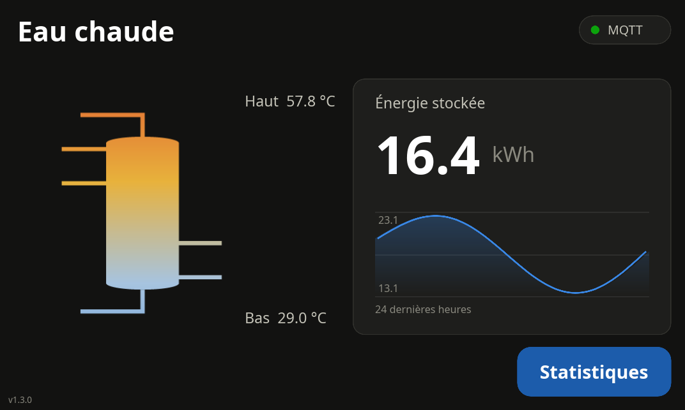
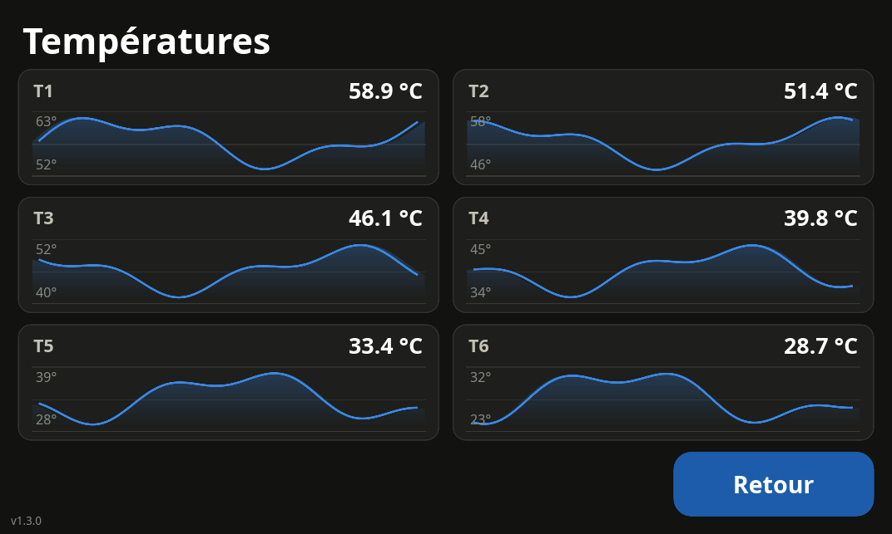

# boilert 🌡️

`boilert` is a Water Boiler Monitoring application built with Rust and [Slint UI](https://slint.dev/). It runs on a Raspberry Pi with the official 7" touchscreen (800x480), monitors 1 to 6 evenly spaced 1-Wire temperature sensors in a cylindrical hot water tank, calculates the stored thermal energy, and publishes everything to an MQTT broker.

| Dashboard | Statistics |
|-----------|------------|
|  |  |

*Screenshots taken in simulation mode with demo data.*

## Features

- **Real-time Monitoring**: Visualizes from 1 to 6 temperature sensors simultaneously, depending on configuration.
- **Energy Calculation**: Automatically calculates the thermal energy stored in your boiler (kWh), slice by slice; the slice of a failed sensor is interpolated from its neighbors, consistently with the tank drawing.
- **Stratification Display**: The boiler drawing is tinted with a 6-stop gradient interpolated from the measured temperatures (hot at the top, cold at the bottom).
- **Energy History**: A 24-hour graph of the stored energy is shown below the total on the dashboard.
- **Temperature History**: An auto-scaled 24-hour graph for each sensor (15-minute resolution), persisted across restarts.
- **MQTT Integration**: Publishes retained sensor data, energy metrics, and an availability topic (last will) to your home automation system.
- **Status Indicators**: MQTT connection state and sensor failures are visible directly on the screen.
- **Touch-friendly UI**: Borderless 800x480 window, large navigation buttons at the same position on every screen, optional fullscreen kiosk mode.
- **Dual Mode**: Runs in simulation mode on workstations (no hardware needed) or reads real DS18B20 sensors on a Raspberry Pi.

The user interface is documented in detail in [SLINT_UI.md](SLINT_UI.md).

---

## Project Structure

```
├── src/
│   ├── main.rs        # Orchestration: sensor loop, MQTT, UI updates
│   ├── config.rs      # TOML configuration loading and validation
│   ├── sensors.rs     # DS18B20 reading (Pi) / simulation (workstation)
│   ├── energy.rs      # Stored-energy calculation
│   └── history.rs     # 24 h histories, persistence, SVG graph generation
├── ui/                # Slint UI (see SLINT_UI.md)
│   └── assets/        # boiler.svg drawing
├── deploy/
│   └── boilert.service  # Sample systemd unit
├── config.toml        # Sample configuration
└── build.rs           # Slint compilation
```

---

## Prerequisites

- **Rust Toolchain**: [Install Rust](https://www.rust-lang.org/learn/get-started).
- **MQTT Broker**: Access to an MQTT broker (e.g., Mosquitto).
- **Hardware (Optional)**:
  - Raspberry Pi with 1-Wire interface enabled (`dtoverlay=w1-gpio` in `/boot/config.txt`).
  - DS18B20 temperature sensors.
  - Official 7" touchscreen (800x480) — the UI is designed for it but runs in a window on any desktop.
  - A companion **1-Wire interface PCB** for the Raspberry Pi GPIO header is available as a separate KiCad project: [guycorbaz/1wire_raspi_pcb](https://github.com/guycorbaz/1wire_raspi_pcb). It provides Molex Micro-Fit 3.0 connectors for the probes, the bus pull-up resistor and supply filtering, replacing the hand-wired resistor setup.

---

## Installation & Build

### 1. Clone the repository

```bash
git clone https://github.com/guycorbaz/boilert.git
cd boilert
```

### 2. Development / Simulation Mode

To run with simulated data (useful for UI testing):

```bash
cargo run
```

The simulation produces a slow, stratified random walk per sensor (hotter at the top of the tank) so the display and graphs look realistic.

### 3. Raspberry Pi Mode

To build for real hardware, use the `pi` feature:

```bash
cargo build --release --features pi
# or run directly
cargo run --release --features pi
```

Note: the first build compiles Slint and can take a long time on a Raspberry Pi. On low-memory models, limit parallelism with `-j 2`.

### 4. Tests

```bash
cargo test
```

---

## Usage

```bash
boilert [path/to/config.toml]
```

- The configuration file defaults to `config.toml` in the current directory.
- Logging goes to stderr and is controlled with `RUST_LOG` (e.g. `RUST_LOG=debug`).
- The 24 h histories are persisted in the file set by `history_file` (relative paths are resolved against the working directory).

---

## Configuration

```toml
# Persist the 24 h histories across restarts (JSON)
history_file = "boilert-history.json"

[mqtt]
host = "mqtt.home.arpa"
port = 1883
base_topic = "boilert/sensors"
publish_interval_s = 30    # Seconds between MQTT publications (default: 30)

[boiler]
volume_l = 500.0           # Total volume in Liters
reference_temp_c = 15.0    # Baseline cold water temperature
energy_coefficient = 1.162 # Wh/(l·K) (standard for water)

[ui]
fullscreen = false         # true for kiosk mode on the touchscreen

# Sensors are listed from the TOP of the tank to the BOTTOM (1 to 6 sensors).
# On the Pi, find the ids with: ls /sys/bus/w1/devices/
[[sensors]]
name = "Top"
id = "28-000000000001"     # 1-Wire device ID

[[sensors]]
name = "Bottom"
id = "28-000000000002"
```

The configuration is validated at startup: 1 to 6 sensors, positive volume, coefficient and publish interval. `history_file`, `publish_interval_s` and the `[ui]` section are optional (the values above are the defaults).

---

## MQTT API

The application publishes **retained** messages (QoS 1, client id `boilert-<pid>`) to the following topics every `publish_interval_s` seconds:

| Topic | Description | Payload |
|-------|-------------|---------|
| `{base_topic}/{sensor_name}` | Temperature of a specific sensor | `f32` (Celsius, 2 decimals) |
| `{base_topic}/energy` | Total energy stored in the boiler | `f32` (kWh, 3 decimals) |
| `{base_topic}/status` | Availability (last will) | `online` / `offline` |

- A sensor that fails to read is *not* published (its last retained value stays on the broker); for the energy value its slice is interpolated from the neighboring sensors.
- `online` is published (retained) after each successful connection; `offline` is set by the broker through the last will when the connection drops.
- An unreachable broker never blocks the measurement loop: publications are queued and dropped if the queue is full.

---

## Deployment on Raspberry Pi

📖 **A detailed installation manual** (bill of materials, sensor placement on the tank, 1-Wire wiring diagram, commissioning, troubleshooting) is available as a PDF: [`docs/installation-manual/installation-manual.pdf`](docs/installation-manual/installation-manual.pdf) (LaTeX sources alongside).

🔌 **Hardware**: the 1-Wire bus can be wired by hand (see the manual) or built with the dedicated interface PCB designed for this project: [guycorbaz/1wire_raspi_pcb](https://github.com/guycorbaz/1wire_raspi_pcb) (KiCad schematics and board layout).

A sample systemd unit is provided in [`deploy/boilert.service`](deploy/boilert.service). Adjust `User`, `WorkingDirectory` and `ExecStart` to your setup, then:

```bash
sudo cp deploy/boilert.service /etc/systemd/system/
sudo systemctl daemon-reload
sudo systemctl enable --now boilert
journalctl -u boilert -f   # follow the logs
```

Set `fullscreen = true` in the `[ui]` section for kiosk mode on the official 7" touchscreen.

---

## Technical Details

### Energy Calculation

Each sensor represents an equal horizontal slice of the cylindrical tank (sensors evenly spaced along its height):

`E (kWh) = Σ slices ( V/N (L) * max(0, Tᵢ - T_ref) (K) * energy_coefficient ) / 1000`

Slices colder than `reference_temp_c` contribute zero rather than a negative amount. With all slices above the reference this reduces to the classic `V * ΔT_avg * 1.162 / 1000` formula.

The temperature `Tᵢ` of a slice whose sensor has no valid reading is interpolated linearly from the neighboring valid sensors (clamped at the tank ends) — the same profile used to tint the tank drawing — so failed sensors never change the slice weighting.

### Sensor Reading

DS18B20 conversions take ~750 ms each, so all sensors are read **in parallel on blocking threads** at every 2-second tick. A failed reading (CRC error, unplugged sensor) is displayed in red in the UI, leaves a gap in the history, and its slice is interpolated in the energy calculation. The DS18B20 power-on reset value (exactly +85 °C) is rejected as a failed conversion rather than taken as a real temperature.

### History

- **Resolution**: 1 point every 15 minutes.
- **Capacity**: 96 points (24 hours), per sensor plus one buffer for the stored energy.
- **Persistence**: Saved atomically to `history_file` after each point and restored at startup, shifted by the downtime. History files written by older versions (without the energy buffer) are still accepted.
- **Visualization**: Auto-scaled SVG paths (minimum span: 5 °C for temperatures, 2 kWh for energy) rendered by the Slint UI; gaps lift the pen.

---

## Design & Engineering Notes

This section documents, release by release (most recent first), the issues identified during the review of v1.0.0 and how they were addressed.

### Measurement robustness (v1.3.1)

- **Failed sensors mis-weighted the energy calculation** ([#1](https://github.com/guycorbaz/boilert/issues/1)): the tank volume was divided by the number of *valid* readings, silently redistributing the failed slices' volume (with only the top sensor answering, the whole tank was counted at its temperature). The energy is now computed from the last known value per position, with failed slices interpolated from their neighbors — the exact profile the tank drawing shows.
- **The DS18B20 power-on reset value (+85 °C) was accepted as a real reading** ([#2](https://github.com/guycorbaz/boilert/issues/2)): after a sensor brown-out, a read can return exactly 85 °C with a valid CRC even though no conversion ran, spiking the published values and the history. It is now rejected like a CRC failure.

### UI refinements (v1.3.0)

- **Borderless window** (`no-frame`): the title bar no longer pushes the buttons off the 800x480 panel.
- **Boiler drawing restored**: back to the hand-drawn SVG (with its pipes), tinted with the measured 6-stop stratification gradient. The temperature→color ramp is now a "coolwarm" scale (blue → pale blue → amber → red) instead of a direct blue→red interpolation that produced muddy purples.
- **Stored-energy history graph**: a 24 h auto-scaled graph below the total in the energy card, persisted like the sensor histories.

### UI overhaul (v1.2.0)

- Modern dark theme centralized in a `Theme` global: dark surfaces with rounded cards, text tokens, recessive gridlines, and reserved status colors (green/amber/red) paired with icons or labels.
- The boiler was drawn as a vector tank with a **6-stop gradient interpolated from the measured sensor temperatures** (replaced by the tinted SVG drawing in v1.3.0).
- History graphs redesigned: blue series line with a fading area fill, auto-scale bound labels, gaps lift the pen. The SVG viewbox matches the plot's aspect ratio because Slint scales `Path` content preserving it.
- Navigation buttons are large touch targets (180x58, 16pt) placed at the **exact same position on both screens**, and everything fits the 800x480 display with no overlap.

### Reliability issues fixed in v1.1.0

- **Blocking sensor reads overran the tick.** Sensor files were read synchronously inside an async task; a DS18B20 conversion takes ~750 ms, so 6 sequential reads (~4.5 s) overran the 2 s loop and stalled the runtime. Sensors are now read **in parallel on blocking threads** (`spawn_blocking`), and missed ticks are delayed instead of bursting.
- **A failed sensor polluted the measurements with 0.0.** A read error (CRC failure, unplugged probe) was recorded as 0 °C: published to MQTT as a real value, included in the average (collapsing the energy figure), and stored in the history. Failed readings are now excluded from the energy calculation, not published, and leave a gap in the history.
- **No status feedback on the device.** Errors only went to stderr; on a wall-mounted kiosk nobody reads them. The UI now shows the MQTT connection state and a per-sensor failure indication.
- **History was lost on restart and pre-filled with fake data.** The 24 h buffer was initialized with a single reading (a flat line for the first day) and wiped on every restart. It is now persisted to disk (atomic writes) and restored at startup, shifted by the downtime.
- **Fixed 0-100 °C graph scale.** With a useful range of 20-65 °C, the curve used half the plot. Graphs are now auto-scaled with a margin and a minimum 5 °C span.

### MQTT improvements (v1.1.0)

- Retained publications, so consumers get the last value on connect.
- Last will + availability topic (`{base_topic}/status`), so home automation can detect an outage.
- Unique client id (two instances no longer evict each other), 30 s keep-alive, publications throttled by `publish_interval_s`, and non-blocking `try_publish` so an unreachable broker can never stall the measurement loop.

### Operations (v1.1.0)

- Config path as CLI argument, validation at load (1-6 sensors, positive volume/coefficient).
- `tracing`-based logging controlled by `RUST_LOG`, systemd unit in `deploy/`.
- Kiosk fullscreen option, realistic simulation (slow stratified random walk), unit tests.
- All dependencies updated to their latest versions; `Cargo.lock` tracked for reproducible builds.

---

## License

MIT - See [LICENSE](LICENSE) for details.
