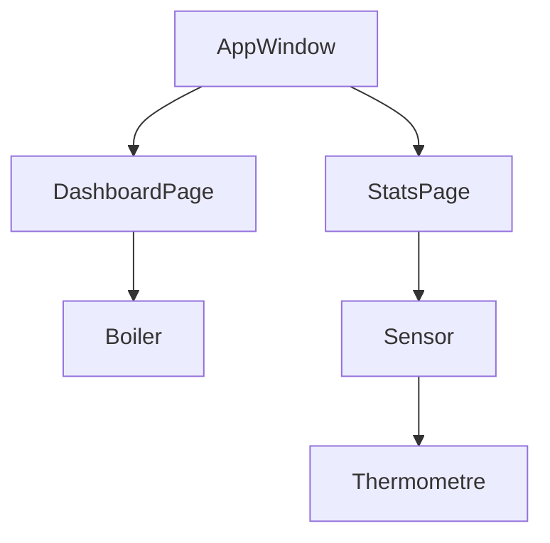

# Slint UI Documentation

This document describes the user interface of the BoilerT application, implemented using [Slint](https://slint.rs/).

## Overview

The interface is designed for an 800x480 screen (standard for small touch displays) and manages the display of boiler status and temperature sensor data.

### Component Hierarchy

## Files and Components

### [app-window.slint](ui/app-window.slint)

The main entry point of the UI. It manages top-level state and page navigation.

- **`AppWindow`**: Inherits from `Window`.
  - `active-page`: Controls which page is displayed (0 for Dashboard, 1 for Stats).
  - `energy_kwh`: Total energy stored in the boiler.
  - `s[1-6]_(name/val)`: Properties for 6 temperature sensors.

### [dashboard.slint](ui/dashboard.slint)

The default landing page.

- **`DashboardPage`**:
  - Displays a visual representation of the boiler using the `Boiler` component.
  - Shows the calculated energy stored in kWh.
  - Contains a "Stat" button to navigate to the statistics page.

### [stats.slint](ui/stats.slint)

Displays detailed temperature data from all sensors.

- **`StatsPage`**:
  - Arranges six `Sensor` components in a grid.
  - Provides a "Retour" (Back) button to return to the dashboard.

### [sensot.slint](ui/sensot.slint)

A reusable component to display individual sensor data.

- **`Sensor`**:
  - Shows a thermometer icon (`Thermometre` component).
  - Displays the sensor name and current value in Celsius.
  - Displays a blue line chart showing 24-hour temperature history on a black background.
  - `history_path`: Property containing the SVG path for the trend line.

### [boiler.slint](ui/boiler.slint)

Visual representation of the hot water tank.

- **`Boiler`**:
  - Renders `assets/boiler.svg`.
  - Properties for `top-color` and `bottom-color` (currently using default values).

### [thermometre.slint](ui/thermometre.slint)

A simple icon component.

- **`Thermometre`**: Renders `assets/thermometre.svg`.

### [styles.slint](ui/styles.slint)

Global styling properties.

- **`PageStyle`**: Contains layout constants like `ext_padding`.

### [pages.slint](ui/pages.slint)

A helper file that exports all major pages for easier importing in `app-window.slint`.

## Navigation Flow

1. **Dashboard**: Shows summary. User clicks "Stat".
2. **AppWindow**: Updates `active-page` to 1.
3. **StatsPage**: Becomes visible. User clicks "Retour".
4. **AppWindow**: Updates `active-page` to 0.
