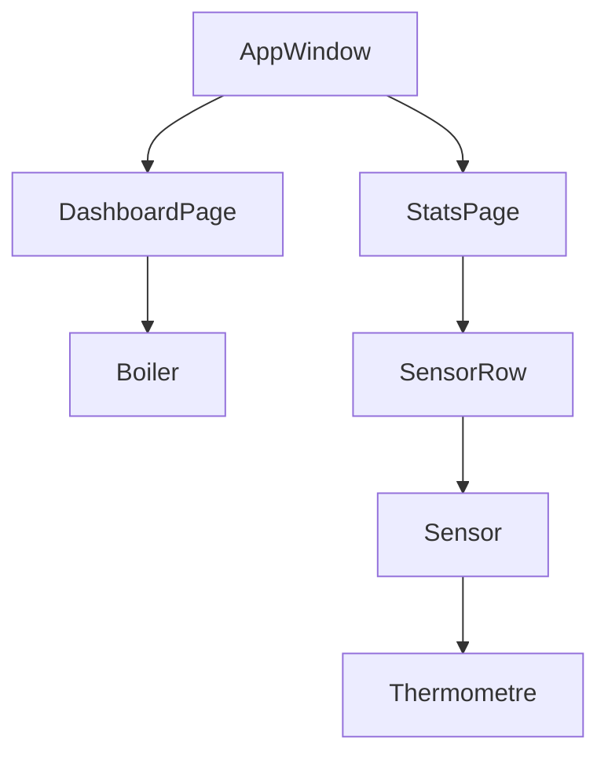

# Slint UI Documentation

This document describes the user interface of the BoilerT application, implemented using [Slint](https://slint.rs/).

## Overview

The interface is designed for an 800x480 screen (standard for small touch displays) and manages the display of boiler status and temperature sensor data. An optional kiosk mode (`[ui] fullscreen = true` in `config.toml`) makes the window fullscreen.

### Component Hierarchy

```mermaid
graph TD
    AW[AppWindow] --> DP[DashboardPage]
    AW --> SP[StatsPage]
    DP --> B[Boiler]
    SP --> SR[SensorRow]
    SR --> S[Sensor]
    S --> T[Thermometre]
```

## Files and Components

### [app-window.slint](ui/app-window.slint)

The main entry point of the UI. It manages top-level state and page navigation.

- **`AppWindow`**: Inherits from `Window`.
  - `active-page`: Controls which page is displayed (0 for Dashboard, 1 for Stats).
  - `energy-text`: Pre-formatted total energy stored in the boiler (kWh).
  - `mqtt-connected`: True while the MQTT broker connection is up.
  - `sensors-ok`: False when at least one sensor failed its last reading.
  - `boiler-top-color` / `boiler-bottom-color`: Stratification colors computed by the backend from the top/bottom sensor temperatures.
  - `sensors`: A model of `SensorData` for each configured thermometer (1-6).

### [dashboard.slint](ui/dashboard.slint)

The default landing page.

- **`DashboardPage`**:
  - Displays a visual representation of the boiler using the `Boiler` component, tinted with the measured stratification gradient.
  - Shows the calculated energy stored in kWh.
  - Shows an MQTT connection indicator (green/red dot) and a sensor failure warning.
  - Contains a "Stat" button to navigate to the statistics page.

### [stats.slint](ui/stats.slint)

Displays detailed temperature data from all sensors.

- **`StatsPage`**:
  - Arranges sensors in a **two-column layout** using the `SensorRow` helper component (up to 3 rows).
  - Provides a "Retour" (Back) button to return to the dashboard.
- **`SensorRow`**: One row of the grid, showing sensors `first` and `first + 1` (the second only if present).

### [sensor.slint](ui/sensor.slint)

A reusable component to display individual sensor data.

- **`SensorData`**: A struct containing:
  - `name`: string
  - `value-text`: pre-formatted current value (e.g. `"54.3 °C"`, or `"--"` when unknown)
  - `ok`: false when the last reading failed
  - `history-path`: SVG path commands for the auto-scaled 24-hour trend line
  - `hist-min-text` / `hist-max-text`: labels of the auto-scaled y-axis bounds
- **`Sensor`**:
  - Shows a thermometer icon (`Thermometre` component).
  - Displays the sensor name and last valid value in Celsius (in red, with a red border, when the sensor is failing).
  - Displays a line chart showing the 24-hour temperature history with its scale bounds; gaps in the data lift the pen.

### [boiler.slint](ui/boiler.slint)

Visual representation of the hot water tank.

- **`Boiler`**:
  - Renders `assets/boiler.svg`, colorized with a vertical gradient from `top-color` to `bottom-color` (the measured stratification).

### [thermometre.slint](ui/thermometre.slint)

A simple icon component.

- **`Thermometre`**: Renders `assets/thermometre.svg`.

### [styles.slint](ui/styles.slint)

Global styling properties.

- **`PageStyle`**: Contains layout constants like `ext_padding`.

### [pages.slint](ui/pages.slint)

A helper file that exports all major pages (and `SensorData`) for easier importing in `app-window.slint`.

## Navigation Flow

1. **Dashboard**: Shows summary. User clicks "Stat".
2. **AppWindow**: Updates `active-page` to 1.
3. **StatsPage**: Becomes visible. User clicks "Retour".
4. **AppWindow**: Updates `active-page` to 0.
