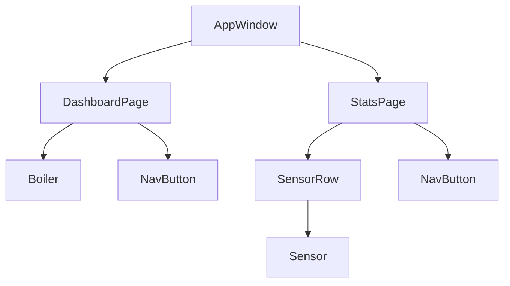

# Slint UI Documentation

This document describes the user interface of the BoilerT application, implemented using [Slint](https://slint.rs/).

## Overview

The interface is designed for an 800x480 screen (the official Raspberry Pi 7" touch display) and manages the display of boiler status and temperature sensor data. The window is borderless (`no-frame`) so the full panel is usable; an optional kiosk mode (`[ui] fullscreen = true` in `config.toml`) makes it fullscreen.

The look is a modern dark theme: dark surfaces with rounded cards, text tokens (primary/secondary/muted), a blue data series for the graphs, and reserved status colors (green/amber/red). All of it is centralized in the `Theme` global.

### Component Hierarchy

```mermaid
graph TD
    AW[AppWindow] --> DP[DashboardPage]
    AW --> SP[StatsPage]
    DP --> B[Boiler]
    DP --> NB1[NavButton]
    SP --> SR[SensorRow]
    SP --> NB2[NavButton]
    SR --> S[Sensor]
```

## Files and Components

### [styles.slint](ui/styles.slint)

The design system of the application.

- **`Theme`** (global): surfaces (`bg`, `card`, `card-border`), text tokens (`text-primary`, `text-secondary`, `text-muted`), the graph series color, status colors (`good`, `warning`, `critical`), and layout constants (`pad`, `radius`).
- **`NavButton`**: large touch-friendly navigation button (180x58, 16pt). Every page places it at the same spot (bottom right, `Theme.pad` margins) so navigation never moves between pages.

### [app-window.slint](ui/app-window.slint)

The main entry point of the UI. It manages top-level state and page navigation.

- **`AppWindow`**: Inherits from `Window`.
  - `active-page`: Controls which page is displayed (0 for Dashboard, 1 for Stats).
  - `energy-text`: Pre-formatted total energy stored in the boiler (kWh).
  - `mqtt-connected`: True while the MQTT broker connection is up.
  - `sensors-ok`: False when at least one sensor failed its last reading.
  - `boiler-c0` … `boiler-c5`: Stratification gradient stops computed by the backend (c0 = top of the tank, hottest; c5 = bottom, coldest).
  - `sensors`: A model of `SensorData` for each configured thermometer (1-6).

### [dashboard.slint](ui/dashboard.slint)

The default landing page.

- **`DashboardPage`**:
  - Displays the `Boiler` drawing tinted with the measured stratification gradient, with the top/bottom temperatures labeled next to it.
  - Shows the stored energy as a hero number inside a card, with a 24 h history graph of the stored energy below it (same style as the sensor graphs, 320x100 viewbox).
  - Shows an MQTT connection chip (green/red dot + label) and a sensor failure chip (amber, icon + label) in the top right.
  - `NavButton` "Statistiques" navigates to the statistics page.

### [stats.slint](ui/stats.slint)

Displays detailed temperature data from all sensors.

- **`StatsPage`**:
  - Arranges up to 6 sensor cards in a **two-column, three-row grid** using the `SensorRow` helper component. The grid stops above the navigation button so nothing overlaps it.
  - `NavButton` "Retour" returns to the dashboard.
- **`SensorRow`**: One row of the grid, showing sensors `first` and `first + 1` (the second only if present).

### [sensor.slint](ui/sensor.slint)

A card displaying an individual sensor.

- **`SensorData`**: A struct containing:
  - `name`: string
  - `value-text`: pre-formatted current value (e.g. `"54.3 °C"`, or `"--"` when unknown)
  - `ok`: false when the last reading failed
  - `history-path`: SVG commands of the auto-scaled 24-hour trend line
  - `history-fill`: SVG commands of the closed area under the line (gradient fill)
  - `hist-min-text` / `hist-max-text`: labels of the auto-scaled y-axis bounds
- **`Sensor`**:
  - Header with the sensor name and its last valid value (value and border turn red when the sensor is failing).
  - A 24-hour line chart with a fading area fill, recessive gridlines, and y-axis bound labels. Gaps in the data lift the pen.
  - The chart `Path` uses a 600x100 viewbox matching the ~6:1 aspect ratio of the graph area, because Slint scales a `Path` viewbox preserving its aspect ratio.

### [boiler.slint](ui/boiler.slint)

Visual representation of the hot water tank.

- **`Boiler`**:
  - Renders the hand-drawn `assets/boiler.svg` (tank with pipes), colorized with a 6-stop vertical gradient (`c0` at the top … `c5` at the bottom). The backend interpolates the measured sensor temperatures along the tank height, so the drawing shows the *actual* stratification.
  - The temperature→color mapping is a "coolwarm" ramp (blue → pale blue → amber → red), which avoids muddy purples and green hues.

### [pages.slint](ui/pages.slint)

A helper file that exports all major pages (and `SensorData`) for easier importing in `app-window.slint`.

## Navigation Flow

1. **Dashboard**: Shows summary. User taps "Statistiques".
2. **AppWindow**: Updates `active-page` to 1.
3. **StatsPage**: Becomes visible. User taps "Retour".
4. **AppWindow**: Updates `active-page` to 0.

The two navigation buttons share the exact same size and position, so the user's finger never has to move between screens.
